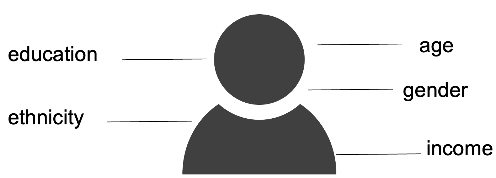

# 03. Descriptive statistics

## R Script file

Copy the code below ➜ Paste into RStudio console ➜ Hit "Enter"

```r
source(url("https://raw.githubusercontent.com/ttezcann/regression-social-sciences/main/scripts/0_packages.R")); 
source(url("https://raw.githubusercontent.com/ttezcann/regression-social-sciences/main/scripts/0_load_gss_data.R")); 
download.file("https://raw.githubusercontent.com/ttezcann/regression-social-sciences/main/scripts/1_introduction_to_rstudio.R", "1_introduction_to_rstudio.R"); 
file.edit("1_introduction_to_rstudio.R")
```

## Assignment

[RStudio lab assignment: Generating a table](https://docs.google.com/document/d/1MV_wr7Jj5DpaCE2Jgnkgln01Aj8c7VHg?rtpof=true\&usp=drive_fs)

### Sample lab assignment

SAMPLE: [RStudio lab assignment: Generating a table](https://docs.google.com/document/d/1MV_wr7Jj5DpaCE2Jgnkgln01Aj8c7VHg?rtpof=true\&usp=drive_fs)

## Content: Descriptive statistics

### Learning outcomes

1. Learn the differences between categorical (binary, nominal, ordinal) and continuous variables
2. Learn how to run and interpret frequency tables
3. Learn how to run and interpret descriptive tables
4. Learn how to create bar graph and histogram
5. Refresh knowledge of keyboard and mouse shortcuts and using model codes

### What is variable?

* A variable is any characteristics, number, or quantity that can be measured or counted.
* Any piece of information we know about our subjects (e.g., individuals).

#### Demographic variables

Questions about respondents’ demographics are called demographic or control variables. 

#### Contextual variables

Questions about respondents’ attitudes, beliefs, or behaviors, are called contextual variables.
