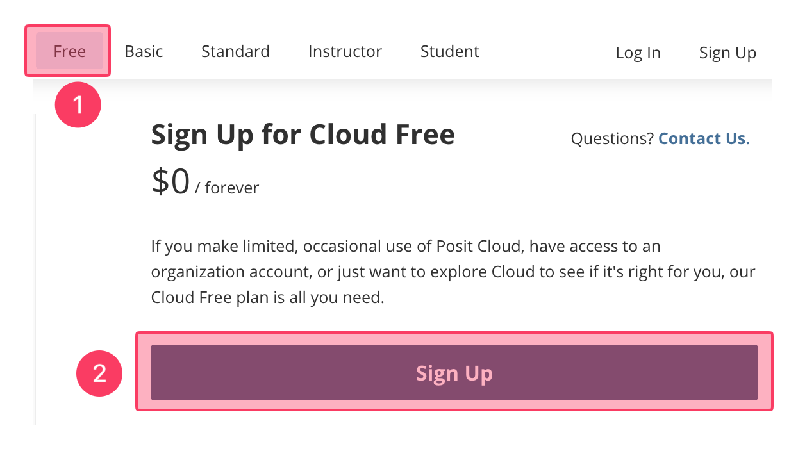
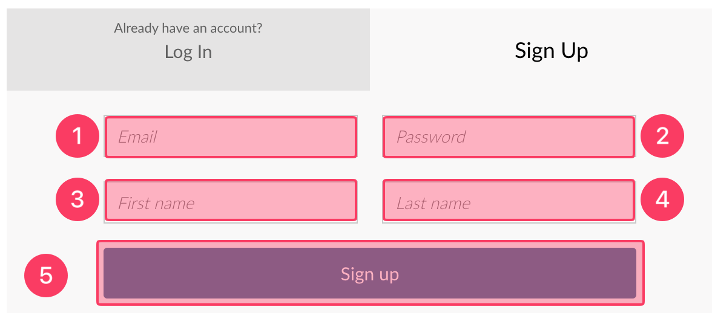
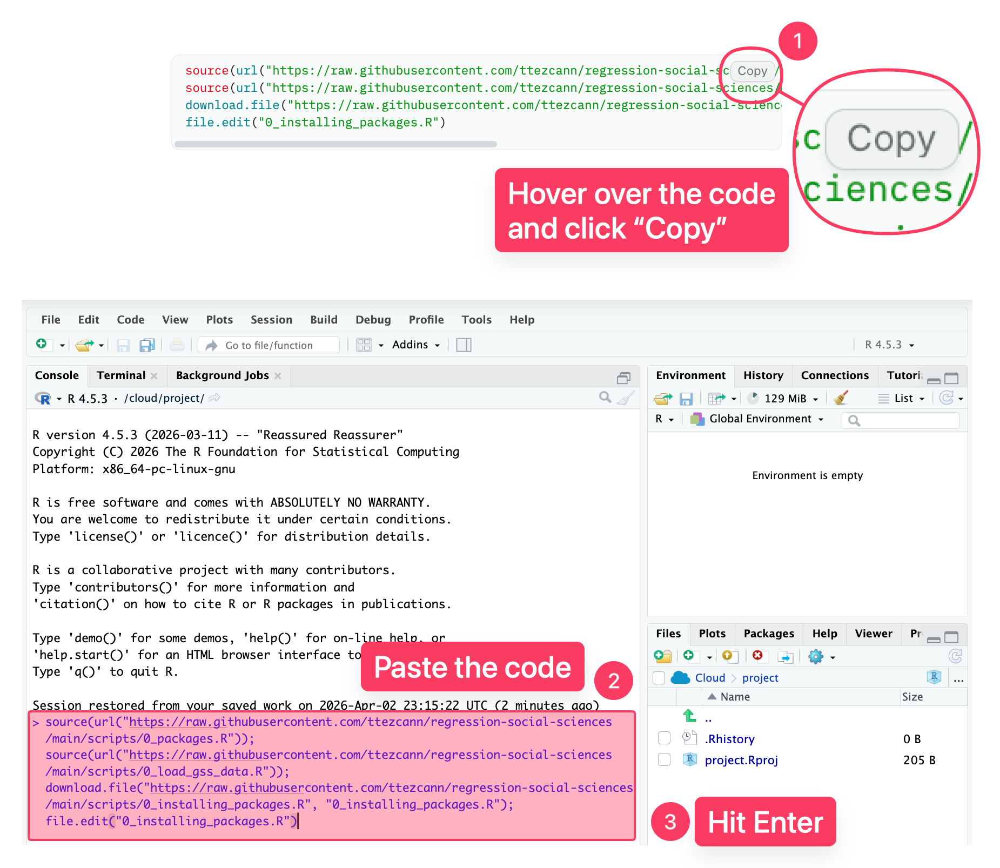

# Create a free RStudio Cloud account and install packages



### RStudio Cloud website

1. Go to [https://posit.cloud/plans/free](https://posit.cloud/plans/free) and make sure you choose “free.”
2. Click "Sign up."

<figure><figcaption></figcaption></figure>



### Email address and password

1. Put your email address.
2. Put a password (at least 10 characters). You must:
   1. Use upper and lower case letters,
   2. Use numbers,
   3. Use special characters.
3. Type your first name.
4. Type your last name.
5. Click "Sign up."

<figure><figcaption></figcaption></figure>



### Verification

1. Go to your  email inbox and click “Verify.”
2. You will be directed to the website.&#x20;
   1. If not, click: [https://posit.cloud](https://posit.cloud/plans/free).&#x20;



### Create a new project (RStudio labs)


1. Click "New Project."
2. Choose "New RStudio Project."
   1. You will wait 10-15 second while RStudio deploys the project. If it takes longer, refresh your page.
3. On the new screen, click on “Untitled Project” and type “RStudio labs”.

<figure><figcaption></figcaption></figure>


Many users mistakenly create a separate project for each lab. **This is incorrect.** You will not create a new project for each lab. Instead, you will always work within the existing 'RStudio labs' project throughout the modules.


<figure><figcaption></figcaption></figure>



### Download the specific R script file to install packages and load GSS data

1. Copy the code below.
2. Paste it into RStudio console.
3. Hit enter.

```r
source(url("https://raw.githubusercontent.com/ttezcann/regression-social-sciences/main/scripts/0_packages.R")); 
source(url("https://raw.githubusercontent.com/ttezcann/regression-social-sciences/main/scripts/0_load_gss_data.R")); 
download.file("https://raw.githubusercontent.com/ttezcann/regression-social-sciences/main/scripts/0_installing_packages.R", "0_installing_packages.R"); 
file.edit("0_installing_packages.R")
```

<figure><figcaption></figcaption></figure>




### Wait

This process will install all the packages we’ll be using throughout the modules. This process may take **15-20 minutes** or shorter depending on your internet connection. This is a one-time process.

You won't wait this long again during the semester.

1. You will see a STOP sign.
2. And, codes are running in the console. You should wait until the 🛑 <mark style="background-color:$danger;">STOP</mark> 🛑 sign in the console disappears and no more code is running in the console.
3. When you see the script file opens and, "gss" and "key" appears under the "Environment" - Data section, everything is all set.

<figure><figcaption></figcaption></figure>



